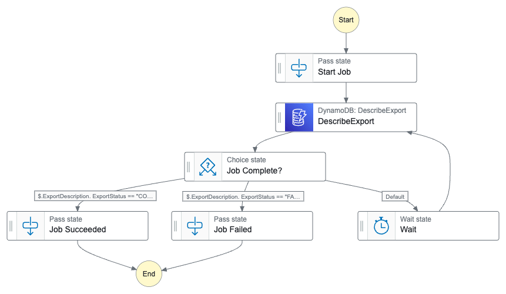

AWS Step Function - Job Poller Pattern
==============================================================================
Keywords: AWS Step Function, StepFunction, SFN, State Machine, StateMachine, Root, Patterns, Poll Job, Async

Summary of the Problem
------------------------------------------------------------------------------
在 Orchestration 中, 经常会有需要 Async 运行一个 Job, 运行之后你需要等待 Job 完成才能进行下一步. 对于支持 `Optimized integrations <https://docs.aws.amazon.com/step-functions/latest/dg/connect-supported-services.html>`_ 模式的服务, 例如 AWS Lambda, Batch, Glue, SageMaker, CodeBuild, Step Function 等服务, 原生就支持 Sync 调用 (等这些 Job 完成后才会进行下一步, 但实际上是异步调用, 等待时间并不收费). 你只需要点击 Workflow Studio 中的一个按钮即可.

官方推荐使用内置的 Widget 有 Poll Job 的模式, 你可以通过拖曳来实现: ``运行 -> 等待 (Wait) -> 检查状态 (Get Job Status) -> 等待 -> 检查状态 (check) -> ... -> 超时或者检查到了成功或者失败的状态``. 不过官方并没有对下面这两个问题做出解释, 我来补充一下:

1. 不是所有的 Service 都有 check status 这种 built in 的 Widget 的. 所以更加通用的方法是用 Lambda 来 run job, 同样用 Lambda 来 check status.
2. Poll Job 默认不支持子循环级的 Timeout, 用整个 State Machine 的 Timeout 来控制也不是个好办法. 因为你一个 State Machine 中可能有多个 Poll Job 的循环, 你无法精确控制每个循环的 Time Out 时间. 这里有两种解决方案:
    1. 在 Wait 的 State 中我们给他一个参数叫 Wait Count. 然后在将这个参数在整个 Wait 的 Loop 中传递, 每运行一次 Get Job Status Task 就将其加 1, 并且传递给 Choice. Choice 每次先检查 Status, 如果还是 in progress 则继续检查 Wait Count, 超过了指定上线则报错. 例如你的 Wait Count 是 10, 而 wait time 是 6, 那么就是 1 分钟后报错.
    2. 在 Get Job Status Task 中用 Lambda, 然后让 Lambda 来调用 API 检查 Status, 并且利用 execution id 来生成一个唯一的 Key, 然后将第一次 get job status 的时间写入到用 Key 决定的外部存储中, 并且每次都跟这个事件比较, 如果超时了就直接 raise error 即可. 这个外部存储可以是 Dynamodb 也可以是 S3.

1 比较好, 但是实现起来没有那么直观. 而 2 比较直观, 但是实现起来稍微麻烦点. 我没有强烈的偏好, 两者都行.

Proposed Solution
------------------------------------------------------------------------------
本例中我们实现了 #2 中的解决方案.

Overview:

- 一定要用 Standard State Machine, 不要用 Express. 因为很多时间都在等待, 并且可能会超过 Express 5 分钟的限制
- 对 Async Job 的调用要包装在一个 Lambda 中, 这样你有更多的控制权. 这个 Lambda 我们叫做 "Run Job".
- "Run Job" 的 Lambda 的 Payload 不要用默认的 "$", 而要用 "$$", "$$" 的意思是将整个 Step Function 的 Context 作为 Lambda 的输入, 其中 State Input 是里面的一个 field. Context 中包含了 execution arn, 你可以用 execution arn 作为一个 Key, 将属于这个 execution 的 metadata 写入到外部存储, S3, DynamoDB 都可以, 其中 Key 可以作为 S3 的 uri, 或是 DynamoDB 的 hash key (我们这个例子中用的是 S3), 这样后续的 Task 就可以读到这些 metadata. 这里的关键是这个 Lambda run job 之前, 将 start time 写入到 S3, 这样后面的 "Get Job Status" Lambda 就可以用这个 start time 作为一个 timeout 的依据.
- 然后就是用 Step Function 里面的 Poll Jober 的 Pattern, 不过 "Get Job Status" 的步骤是一个 Lambda, 这个 Lambda 要干两件事: 一是从 S3 读 Metadata 确认是否 Timeout, 二是查询 Job Status 如果成功或失败就返回代表成功或失败的值, 如果都不是就返回一个默认值, 例如 "running".
- 然后就用 Choice State 来判断, 如果不是成功或失败就回到 Wait.
- 这里的 Wait 的间隔挺重要的, 因为 Standard State Machine 是按照 Transition 收费的, 所以你需要尽量减少 Transition 的次数. 比如你的 Job 需要至少 15 分钟, 至多 30 分钟 完成, 那么你需要在 Start Job 之后直接放一个 Wait 15 分钟, 然后每次循环的 Wait 则是 1 分钟. 我见过很多人不加思考的在循环中每 1 秒 Check 一次 Job Status, 这样非常浪费钱.

``sfn_pattern_job_poll_0_job_runner.py``:

.. literalinclude:: ./sfn_pattern_job_poll_0_job_runner.py
   :language: python

``sfn_pattern_job_poll_1_run_job.py``:

.. literalinclude:: ./sfn_pattern_job_poll_1_run_job.py
   :language: python

``sfn_pattern_job_poll_2_check_status.py``:

.. literalinclude:: ./sfn_pattern_job_poll_2_check_status.py
   :language: python

``sfn_pattern_job_poll_definition.json``:

.. literalinclude:: ./sfn_pattern_job_poll_definition.json
   :language: json

Use AWS SDK Integration for Job Poller
------------------------------------------------------------------------------
在上面这个例子中, 无论是 Job Runner, 还是 Check Status, 还是 If else Choice 都是用 Lambda Function 实现的. 也就是说我们在 Lambda Function 里面的代码中用 boto3 去调 AWS API. 这样做的好处是一是比较灵活, 二是可以查文档的输入输出, 控制的更加精确. 坏处就是你需要多维护几个 Lambda Function.

你在 Step Function 的 design studio 里会看到左边有很多可以 drag and drop 的图标, 这些图标就是 AWS SDK 中的 API 的 caller, 也叫做 AWS SDK Integration. 你用这些图标可以无需使用 Lambda Function, 直接调 API, 减少了运维的复杂度, 也减少了开支 (这个功能不收钱). 但是官放文档称这些图标的输入输出是跟 AWS SDK 一样的, 但是对于开发者来说, 这种说明非常不透明, 经常会有需要猜测的地方.

这里我们用 DynamoDB Export Table 为例, 全部使用 AWS SDK Integration 来实现一次 Job Poller 的模式.

下图是我们的 Step Function:

下面是 SFN 的 definition:

.. dropdown:: dynamodb_export_sfn_def.json

    .. literalinclude:: ./dynamodb_export_sfn_def.json
       :language: javascript
       :linenos:

这里最关键的是 DynamoDB Describe Export 这一步里的 ``"ExportArn.$": "$.ExportDescription.ExportArn"``::

    "DescribeExport": {
      "Type": "Task",
      "Parameters": {
        "ExportArn.$": "$.ExportDescription.ExportArn"
      },
      "Resource": "arn:aws:states:::aws-sdk:dynamodb:describeExport",
      "Next": "Job Complete?"
    },

根据 API 文档 `describe_export <https://boto3.amazonaws.com/v1/documentation/api/latest/reference/services/dynamodb/client/describe_export.html>`_, 这个 API 返回值是这样的::

    {
        "ExportDescription": {
            "ExportArn": ...,
            "ExportStatus": ...,
            ...,
        }
    }

这个值会在 Choice 这一步中用 ``"Variable": "$.ExportDescription.ExportStatus",`` 进行判断. 如果还在 in progress, 则这个 describe_export API 的返回值会被一直 pass through 到 Wait 这一步, 然后又会返回给 ``DescribeExport`` 这一步. 所以等于是 ``DescribeExport`` 在第一次的时候要从别的地方拿数据作为 input, 而 wait 之后则是用自己的返回值作为 input. 所以你的 ``DescribeExport`` 的这一步 ``"Parameters": {"ExportArn.$": "$.ExportDescription.ExportArn"}`` 的逻辑必须是从这个 API 的返回值拿 Input. 而 ``DescribeExport`` 的前一步就需要将输出整理成跟 API 的返回值类似的格式.

在我们的测试代码 ``dynamodb_export_sfn_test.py`` 中, 我们整个 Step Function 的 Input 就是 ``{"ExportDescription": {"ExportArn": ...}}``, 它被一直 pass through 给了 ``DescribeExport``. 当然你的 Input 可以是任何结构, 你只要在 ``DescribeExport`` 的前一步的 OutputPath Selector, 或者 ``DescribeExport`` 本身的 InputPath Selector 将其整理成这个格式既可.

.. dropdown:: dynamodb_export_sfn_test.py

    .. literalinclude:: ./dynamodb_export_sfn_test.py
       :language: python
       :linenos:

总结下来, 你要用 AWS SDK Integratin 来实现 Job Poller, 你最重要的是阅读那个 Get Status 的 API, 例如 `EC2.describe_instances <https://boto3.amazonaws.com/v1/documentation/api/latest/reference/services/ec2/client/describe_instances.html>`_, 看看它的返回值的 status 在哪里, 以及他本身的 resource identifier 在哪里, 然后你的 Get Status 这一步的 Input 就是用返回值反过来构造自己的输入参数. 然后你前面的步骤都适应这个构造语法既可.
