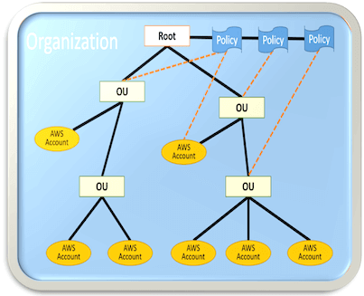
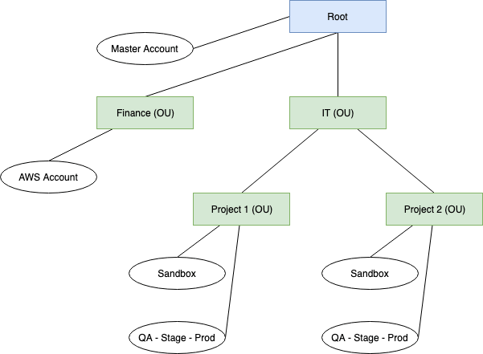

AWS Organizations User Guide
==============================================================================
Keywords: AWS, Amazon, Organization, Org

Overview
------------------------------------------------------------------------------
本文是对 `AWS Organizations User Guide <https://docs.aws.amazon.com/organizations/latest/userguide/orgs_introduction.html>`_ 文档中的内容的提炼和总结.

Why I need AWS Organizations
------------------------------------------------------------------------------
1. 首先我们要知道的是, 一个 AWS 账户下的资源是有限制的, 比如默认状态下最多能创建 5 个 EIP IPV4 地址, 最多能创建 100 个 S3 Bucket, 最多创建 200 个 CloudFormation Stack, 等等, 如果要提高这些限制, 你需要联系 AWS 提高这些限制. 所以对于企业用户, 一个企业不可能只有 1 个 AWS 账户.
2. 其次一个企业有不同的部门, 你不希望一个部门或是一个项目的管理员能够有权限更改其他部门或是项目的云资源. 最简单的隔离方法就是使用不同的 AWS 账户 (它们天生就是隔离的).

Concepts
------------------------------------------------------------------------------
在进入企业用户的 AWS 账号管理之前, **首先, 我们来了解一下 AWS Account 和 AWS Organization 的一些基本概念**.

- Ref: https://aws.amazon.com/cn/blogs/china/aws-organizations-multi-account-management/

- Organization - 组织: 一系列的 AWS 账户.
- AWS account – 账户: 单个 AWS 账户.
- Master account – 主账户: 在组织中为所有账户付款的账户, 管理你的组织的中心节点.
- Organizational unit (OU) – 组织单元: 逻辑上的 子 Organization, 由多个 AWS 账户组成, 跟 AWS 账户是 多对多 的关系.
- Administrative root – 管理根: 管理根是整理AWS账户的起始点, 也是整个组织层次架构中的最顶层的容器.
- Organization control policy (OCP) – 组织控制策略: 定义您要应用于某个 Organization 或 OU 的 AWS账户的控制策略. 而具体的 Policy 叫做 Service Control Policies (SCP), OCP 是一个概念, SCP 是 OCP 的一个实例.

所以, 假设你是一个初创企业, 你的 AWS 账户管理应该是这样的:

而具体你的 AWS accounts 架构应该是怎样的, 建议参考我的这篇博文 :ref:`organizing-your-aws-environment-using-multiple-accounts`.

**权限控制**:

子 OU 会从母 OU 继承 Policy. 而在某个 OU 下的 AWS 账户中的 IAM User 和 Role 的最终权限, 由 OU 的 SCP 以及 IAM User / Role 的 Policy 共同决定.

例如: OU 允许你控制 A, B 服务, 而 IAM 允许你控制 B, C 服务, 那么你只能控制 B 服务.

AWS Organization Policy
------------------------------------------------------------------------------
AWS Organization Policy 是一项在 AWS Organizations 服务中的功能. 它和 IAM Policy 类似, 能提供对 AWS Account 细粒度的控制. 官方的原文如下:

    Policies in AWS Organizations enable you to apply additional types of management to the AWS accounts in your organization.

AWS Organization 提供多种不同类型的 Policy, 不过按照功能分可以将其分为两大类.

- Authorization policies: Authorization policies help you to centrally manage the security of the AWS accounts in your organization.
    - `Service control policies (SCPs) <https://docs.aws.amazon.com/organizations/latest/userguide/orgs_manage_policies_scps.html>`_: offer central control over the maximum available permissions for all of the accounts in your organization. 这个最重要, 也最常用. SCP 就像是一个 IAM Policy, 不过它是针对 Account 下所有的 IAM User 和 Role 的, 用来管理这个 Account 下的 User 和 Role 最大的权限范围. 注意, SCP 只是指定最大权限范围, 即使里面包含了允许你访问 XYZ, 但是你还是要用 IAM Policy 给你的 User 和 Role XYZ 的权限才行.. AWS Organization 默认会创建一个 ``FullAWSAccess`` 的 SCP, 而且会自动 attach 给你的所有 Account, 也包括 ROOT 和 OU. 这就意味着默认情况下你下面的所有的 Account 都能用所有的 AWS Services. 而我们如果熟悉 IAM Policy 的话, 它的规则是 "显式Deny > 显式 Allow > 默认 Deny". 也就是说我们一般有两种定义 IAM Policy 的模式, 一种是做加法, 全部默认 Deny, 需要什么加什么. 另一种是做减法, 默认全部 Allow, 不允许用什么减掉什么. 如果我们要做加法, 那么我们就要把这个自动创建的 ``FullAWSAccess`` 从所有的 OU 和 member account 上 Detach 掉, 然后手动创建 SCP 允许一些 AWS Services. 如果我们要做减法, 那么就保留这个 ``FullAWSAccess``, 然后手动创建 SCP 禁止一些 AWS Services.
- Management policies: enable you to centrally configure and manage AWS services and their features.
    - `Artificial Intelligence (AI) services opt-out policies <https://docs.aws.amazon.com/organizations/latest/userguide/orgs_manage_policies_ai-opt-out.html>`_: enable you to control data collection for AWS AI services for all of your organization's accounts. 这个是给 AI 相关的 AWS Services 用的. 因为 AI 相关的 AWS Services 大多都是 AWS Managed, 而且必然要访问你的 business data.
    - `Backup policies <https://docs.aws.amazon.com/organizations/latest/userguide/orgs_manage_policies_backup.html>`_: help you centrally manage and apply backup plans to the AWS resources across your organization's accounts. 这个是给 AWS Backup, 一个用来备份你的 AWS Account 上的数据的全托管服务.
    - `Tag policies <https://docs.aws.amazon.com/organizations/latest/userguide/orgs_manage_policies_tag-policies.html>`_: help you standardize the tags attached to the AWS resources in your organization's accounts. 这个是用来管理你的 Accounts 里面的 Resource Tag 的, 比如要求 TagKey 用 Camel Case 还是 all uppercase. 给定的 TagKey, 它的 Value 必须是指定的几个之一. 或者对 Tagging 做出强制要求.

Ref:

- Managing AWS Organizations policies: https://docs.aws.amazon.com/organizations/latest/userguide/orgs_manage_policies.html?icmpid=docs_orgs_console
